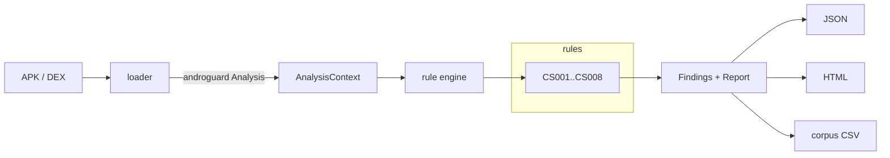

# CryptScan

CryptScan is a command-line tool that decompiles Android APKs and finds cryptographic
misuse through static analysis. It loads an APK with [androguard](https://github.com/androguard/androguard),
walks the Dalvik bytecode and its string and method cross-references, and runs a set of
focused rules for problems like hardcoded keys, ECB mode, broken hashes, weak randomness,
missing certificate validation, and insecure TLS. Results come out as JSON, a styled HTML
report, and a corpus CSV. It is pure Python: no Gradle, no Android Studio, no device needed
for the static scan.

## What it detects

| ID | Rule | Default severity | CWE |
|----|------|------------------|-----|
| CS001 | Hardcoded cryptographic key or secret | Critical | CWE-321 |
| CS002 | Cipher uses ECB mode | High | CWE-327 |
| CS003 | Broken or deprecated algorithm (MD5, SHA-1, DES, RC4) | High / Medium | CWE-327 |
| CS004 | Weak randomness (`java.util.Random`) feeding crypto | High | CWE-330 |
| CS005 | Secret written to SharedPreferences | Medium | CWE-312 |
| CS006 | TrustManager accepts all certificates | Critical | CWE-295 |
| CS007 | Insecure TLS version (SSLv3, TLS 1.0/1.1) | High | CWE-326 |
| CS008 | Home-grown byte-level crypto | Medium | CWE-327 |

## Installation

Requires Python 3.11 or newer.

```bash
git clone <your-fork-url> crypto-decompiler
cd crypto-decompiler
python -m venv .venv && source .venv/bin/activate
pip install .
```

For development, install the extras and run the tests:

```bash
pip install -e ".[dev]"
pytest -q
```

## Quick start

Scan one APK and write both report formats:

```bash
cryptscan scan app.apk --json report.json --html report.html
```

List the rules, or run a subset:

```bash
cryptscan rules
cryptscan scan app.apk --rules CS001,CS002,CS006
```

Gate a CI pipeline on severity (exit code 2 when a finding is at or above the threshold):

```bash
cryptscan scan app.apk --fail-on high
```

Batch-scan a directory into a summary CSV and per-APK JSON:

```bash
cryptscan corpus ./apks --csv summary.csv --json-dir ./reports
```

Fetch a couple of deliberately-insecure demo apps to try it on:

```bash
bash scripts/fetch_sample_app.sh
cryptscan scan sample_apks/insecurebank.apk
```

## Sample output

Scanning [InsecureBankv2](https://github.com/dineshshetty/Android-InsecureBankv2):

```
com.android.insecurebankv2  -  9 findings (1 critical, 0 high, 8 medium, 0 low)  in 7.81s
[CRITICAL] CS001 Hardcoded cryptographic key or secret
    Lcom/android/insecurebankv2/CryptoClass; -> <init>  |  This...[32 chars]
[MEDIUM] CS003 Weak hash algorithm (MD5)
    Lcom/google/android/gms/ads/internal/util/client/zza; -> zzax  |  MD5
[MEDIUM] CS005 Secret stored in SharedPreferences (superSecurePassword)
    Lcom/android/insecurebankv2/DoLogin$RequestTask; -> saveCreds  |  superSecurePassword
```

The HTML report groups findings by severity with remediation guidance. A rendered example
is in [docs/sample-report.html](docs/sample-report.html).

## Architecture



```
cryptscan/
  cli.py            command-line entry point
  loader.py         APK/DEX to androguard Analysis + metadata
  analyzer.py       runs the rules, builds the Report
  findings.py       Severity, Confidence, Finding, Report
  analysis/         shared primitives: entropy, string/method xrefs, local def-use
  rules/            one module per rule, all subclass Rule
  report/           JSON and HTML (Jinja2) renderers
  corpus/           parallel directory scanner
  frida/            optional runtime verification hooks
```

Detection works on androguard's `Analysis` object only. The tool follows string and method
cross-references and does light method-local def-use to tie a constant to the API call that
consumes it (for example, the exact transform passed to `Cipher.getInstance`). The Java
decompiler is never invoked, which keeps a typical scan well under 30 seconds.

## Development

Any Python 3.11+ works. This project was developed on 3.12 provisioned with
[uv](https://github.com/astral-sh/uv):

```bash
uv venv --python 3.12 .venv && source .venv/bin/activate
uv pip install -e ".[dev]"
pytest -q
ruff check . && ruff format --check .
```

The Android SDK is only needed to rebuild the test fixtures, not to run scans. Point
`ANDROID_HOME` at an SDK that has `build-tools;34.0.0` and `platforms;android-34`, then run
`tests/fixtures/build.sh` (see below). A local `sdk/` directory is git-ignored.

## Adding a rule

1. Create `cryptscan/rules/my_rule.py` with a class that subclasses `Rule` and sets
   `id`, `name`, `severity`, `cwe`, and `remediation`.
2. Implement `analyze(self, ctx) -> list[Finding]`. Use the helpers in
   `cryptscan/analysis/xref.py` (`strings_matching`, `getinstance_args`, `app_methods`,
   `classes_implementing`, ...) and build results with `self.finding(...)`.
3. Register the rule in `cryptscan/rules/__init__.py` (`ALL_RULES`).
4. Add a positive and a negative Java sample under `tests/fixtures/src/`, rebuild the
   fixtures, and add a `tests/test_rule_my_rule.py` asserting the positive fires and the
   negative does not.

## Test fixtures

Unit tests run against tiny prebuilt `.dex` and `.apk` fixtures committed under
`tests/fixtures/`, so the suite needs no Android tooling. To change a fixture, edit the
Java under `tests/fixtures/src/` and rebuild with a JDK and Android SDK build-tools:

```bash
ANDROID_HOME=/path/to/android-sdk bash tests/fixtures/build.sh
```

## Dynamic verification (experimental)

With a rooted device or emulator and `frida-server` running, install the extra and confirm
findings at runtime by hooking `Cipher` and `MessageDigest`:

```bash
pip install ".[dynamic]"
cryptscan verify --package com.example.app
```

## License

MIT. See [LICENSE](LICENSE).
